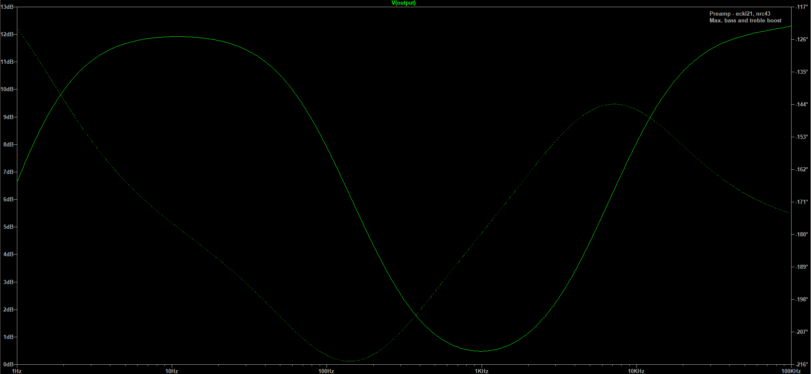
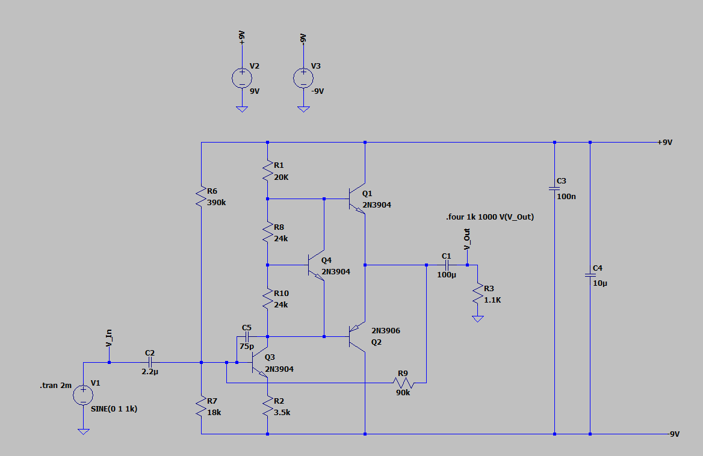
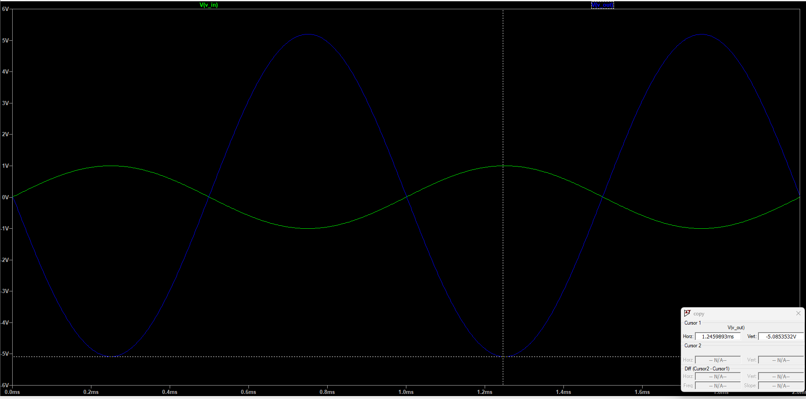

# Simulation Notes

This file records simulation notes for the Audio Amplifier project.

Simulation work includes scope capture (AC + transient), and notes on circuit behaviour. Major simulation changes will be recorded in the change log.

# Pre-amplifier simulation update

An AC sweep simulation was added for the pre-amp stage to show frequency response at max. boost

# Class AB amplifier circuit schematic updated

A circuit schematic was added for the amp stage to be designed on orcad

# Class AB amplifier simuation updated

A class AB amplifier simulation was added to show the voltage gain

